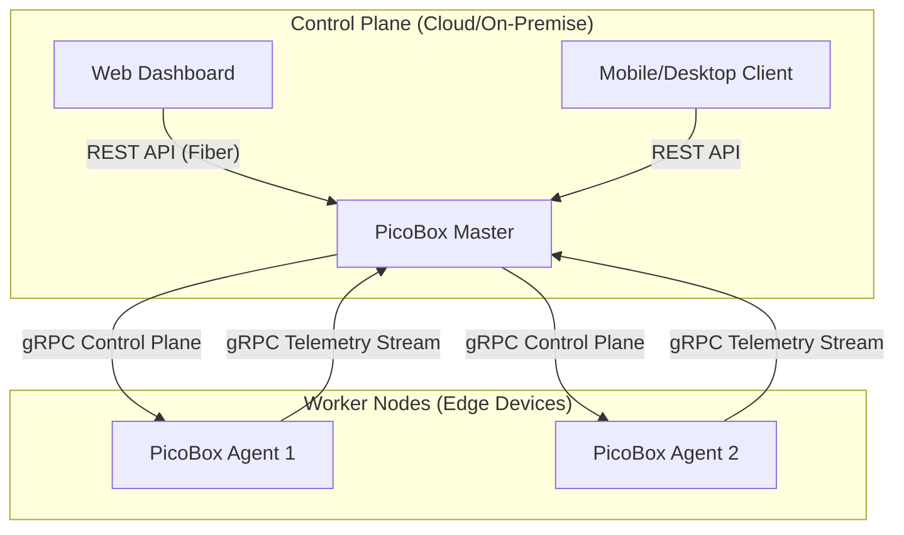

# 🚀 PicoBox: Ultra-Lightweight Distributed Container Platform

PicoBox is a high-performance, ultra-lightweight container orchestration platform designed for Edge Computing and IoT environments. It bypasses heavy container runtimes like Docker or containerd, instead controlling the **Linux Kernel** directly via Namespaces and Cgroups v2.

---

## 🧠 Core Philosophy: "Kernel-First, Zero-Dependency"

PicoBox is built on the belief that for edge devices, every megabyte of RAM and every CPU cycle counts. By utilizing pure Go and direct system calls, PicoBox provides a robust isolation environment with a near-zero footprint.

- **Minimalist Runtime**: No background daemons (like `dockerd`) are required except for the `picoboxd` agent.
- **Direct Orchestration**: The Master server communicates directly with agents via high-performance gRPC streams.
- **Transparent Isolation**: Understand exactly how your containers are isolated using standard Linux tools like `unshare`, `nsenter`, and `lsns`.

---

## ✨ Key Technical Features

### 1. Advanced Process Isolation (Linux Namespaces)
PicoBox utilizes the `clone()` and `unshare()` system calls to wrap processes in dedicated namespaces:
- **PID Namespace**: Isolates the process ID space; the containerized process sees itself as PID 1.
- **Network Namespace**: Provides a private network stack, including its own loopback device and routing tables.
- **Mount Namespace**: Decouples the file system hierarchy, enabling `pivot_root` for complete root file system isolation.
- **UTS & User Namespaces**: Isolates hostnames and grants root-like privileges within the container without compromising the host's security.

### 2. Resource Management (Cgroups v2)
Strict resource boundaries are enforced using the unified Cgroups v2 hierarchy:
- **Memory Limits**: Prevents OOM (Out of Memory) conditions on the host by killing rogue containers.
- **CPU Throttling**: Ensures fair CPU distribution across multiple workloads using `cpu.max`.
- **IO Control**: Monitors and restricts disk IO wait to maintain system responsiveness.

### 3. Distributed Architecture (gRPC & Protocol Buffers)
A contract-first communication layer ensures typed safety and high throughput:
- **Bi-directional Heartbeats**: Agents stream telemetry (CPU, Mem, Disk) to the Master in real-time.
- **Atomic Operations**: Deploying or killing containers are handled via unary gRPC calls with consistent error mapping.

---

## 🏗 System Architecture



---

## 🛠 Tech Stack Deep Dive

| Component | Technology | Rationale |
| --- | --- | --- |
| **Daemon (Agent)** | Go 1.26.1, `x/sys/unix` | Static binaries, direct syscall access, high concurrency. |
| **Master Server** | Go, gRPC, Fiber | Low latency communication, easy-to-use REST interface. |
| **Web UI** | Next.js, Tailwind, Node.js 24 | Modern, responsive, and type-safe frontend. |
| **Protocol** | Protobuf v3 | Compact binary format, cross-language compatibility. |
| **Storage** | OverlayFS, loopback | Efficient layered file systems for container images. |

---

## 📂 Project Structure

```text
picobox/
├── .github/      # CI/CD Workflows (Auto-build & Test)
├── api/proto/    # Protobuf definitions for gRPC contracts
├── bin/          # Output directory for compiled binaries
├── cmd/
│   ├── picoboxd/        # Node agent entrypoint
│   └── picobox-master/  # Central control tower entrypoint
├── internal/
│   ├── api/pb/    # Generated Protobuf Go code
│   ├── isolation/ # Kernel level isolation (Namespaces, Cgroups)
│   ├── network/   # gRPC wrappers and communication logic
│   └── storage/   # RootFS and Volume management
├── scripts/       # Core automation (task.sh)
└── web/          # Next.js 15+ Dashboard UI
```

---

## 🚀 Quick Start Guide

### Prerequisites
- **Kernel**: Linux 5.10+ (Namespaces & Cgroups v2 enabled)
- **Permissions**: **Root access** is mandatory for isolation features.
- **Environment**: Go 1.26.1+, Node.js 24+, `protoc` compiler.

### 🛠 Usage (Task Runner)
PicoBox uses a unified task runner `./scripts/task.sh` for all automation.

| Command | Description |
| --- | --- |
| `setup [ci]` | Install system dependencies, toolchains (Go, Node), and plugins. |
| `doctor` | Verify kernel, cgroups, toolchain, and runtime dependencies. |
| `proto` | Regenerate gRPC Go stubs from `api/proto/picobox.proto`. |
| `build` | Build Go (Master/Agent) and Web binaries (no source mutation). |
| `test [unit]` | Run Go unit tests and Web (Jest) tests. |
| `test e2e` | Run full-stack runtime E2E verification loop (requires root). |
| `e2e --skip-build` | Run E2E against pre-built binaries in `bin/` (used in CI). |
| `test local` | Simulate GitHub Actions locally using `act` (requires act & Docker). |
| `run` | Start Master, Agent, and Web Dashboard in development mode. |
| `stop` | Stop background processes tracked via `logs/*.pid`. |
| `logs [service]` | Tail logs for master / agent / web. Use `clear` to purge. |
| `release` | Build production binaries with `-trimpath`, version metadata, and `checksums.txt`. |
| `clean` | Remove build artifacts (bin/, web/.next, logs/). Safe to re-run. |
| `clean:data` | Remove runtime storage (`.storage/`). Destructive — requires `PICOBOX_CONFIRM_CLEAN_DATA=yes`. |
| `tidy` | Run `go mod tidy` for Go dependency management. |
| `fmt` | Apply gofmt and trim trailing whitespace in-place. |
| `fmt:check` | Verify formatting without modifying files (CI mode). |
| `lint` | Run `golangci-lint` to ensure code quality. |
| `ci` | Reproduce the CI gate locally (`fmt:check → lint → test unit`). |

Local overrides: copy `scripts/env.sh.example` to `scripts/env.sh` (gitignored) to set `PICOBOX_API_TOKEN` and other environment variables.

### Health endpoints
The master exposes two operational endpoints on the REST port (default `:3000`):

| Endpoint | Purpose |
| --- | --- |
| `GET /healthz` | Liveness probe — returns `200 {status, version, commit}` once Fiber is serving. |
| `GET /readyz`  | Readiness probe — returns `200 {status, connected_agents}`; useful for load balancers. |

The distroless container image ships with a tiny `/healthcheck` binary wired up as `HEALTHCHECK CMD`, so Docker / Kubernetes can probe it without requiring `curl` or a shell inside the image.

---

## 🧑‍💻 Development Workflow

This section is the contributor's day-in-the-life guide. Every command below maps 1:1 to a step the CI runs, so "green locally" means "green on PR".

### 0. One-time setup

```bash
./scripts/task.sh setup          # install system pkgs, protoc, Go plugins, golangci-lint
./scripts/task.sh doctor         # verify kernel / cgroups / toolchain / runtime deps
cp scripts/env.sh.example scripts/env.sh   # (optional) local token + path overrides
```

`setup` is idempotent: it reinstalls tools only when the version pin in `scripts/versions.sh` no longer matches. `doctor` is safe to run any time you hit an environment-looking error.

### 1. Inner loop (edit → verify)

Fast feedback, no running services:

```bash
./scripts/task.sh fmt            # gofmt + trim trailing whitespace (writes)
./scripts/task.sh fmt:check      # verify only (CI mode)
./scripts/task.sh lint           # golangci-lint
./scripts/task.sh test unit      # go test -race ./... + web (Jest)
./scripts/task.sh ci             # fmt:check -> lint -> test unit   (single command)
```

Rule of thumb: **run `./scripts/task.sh ci` before every `git push`.** It is the exact contract of the `lint` + `test` CI jobs.

Protobuf changes: after editing `api/proto/picobox.proto`, regenerate stubs explicitly — `build` does this for you, but `proto` is faster when you just want to check generation:

```bash
./scripts/task.sh proto
```

### 2. Build + run the full stack

```bash
./scripts/task.sh build          # proto + Go (agent+master) + Web
./scripts/task.sh run            # start master, agent, web; tails pid files
./scripts/task.sh logs           # follow all service logs (Ctrl+C to exit)
./scripts/task.sh logs master 200   # last 200 lines of a single service
./scripts/task.sh stop           # tear everything down via logs/*.pid
```

`run` binds on `:50051` (gRPC), `:3000` (master REST + WS) and `:3001` (Next.js dashboard). It auto-opens the dashboard if `xdg-open` is available. The agent needs root for namespace/mount work, so expect to run `sudo -E ./scripts/task.sh run` on Linux when you want the full isolation path.

### 3. Integration / E2E verification

The E2E suite lives in `scripts/e2e.sh` and is also routed through `task.sh e2e`. It boots master+agent, exercises auth, deploy+log-streaming, the scheduler, and the WebSocket terminal.

```bash
sudo -E ./scripts/task.sh e2e                 # build first, then run
sudo -E ./scripts/task.sh e2e --skip-build    # reuse existing bin/ (what CI does)
sudo -E ./scripts/e2e.sh --skip-build         # equivalent, bypasses the dispatcher
```

Requirements: root (for mount/namespace work), `busybox` on PATH, and `python3` + `websockets` for the WS test. `doctor` flags any of these as missing; the WS test self-skips if `websockets` isn't installed.

### 4. Release-quality local build

```bash
PICOBOX_VERSION=v0.1.0 ./scripts/task.sh release
./bin/picobox-master --version
cat bin/checksums.txt
```

This is what `GoReleaser` produces in CI for tagged commits: `-trimpath` binaries with `Version/Commit/BuildDate` stamped via `-ldflags -X`, plus a `checksums.txt`.

### 5. CI ↔ local command map

| CI job                   | Local equivalent                                |
| ------------------------ | ----------------------------------------------- |
| `lint` + `test`          | `./scripts/task.sh ci`                          |
| `lint` (formatting)      | `./scripts/task.sh fmt:check`                   |
| `lint` (golangci-lint)   | `./scripts/task.sh lint`                        |
| `test`                   | `./scripts/task.sh test unit`                   |
| `build`                  | `./scripts/task.sh build`                       |
| `e2e`                    | `sudo -E ./scripts/e2e.sh --skip-build`         |
| `release-binaries`       | `./scripts/task.sh release` (+ GoReleaser dry-run) |
| `release-images`         | `docker build -f build/Dockerfile.master .`     |

### 6. Housekeeping

```bash
./scripts/task.sh clean                         # bin/, web/.next, node_modules, logs/
PICOBOX_CONFIRM_CLEAN_DATA=yes \
  ./scripts/task.sh clean:data                  # also remove .storage/ (destructive)
./scripts/task.sh tidy                          # go mod tidy
```

### 7. Contributor checklist

Before opening a PR:

- [ ] `./scripts/task.sh ci` is green.
- [ ] If you touched `api/proto/`, `./scripts/task.sh proto` ran and generated files are committed.
- [ ] If you touched `scripts/` or `.github/workflows/`, you manually ran the affected flow.
- [ ] New runtime dependency? Add it to `scripts/task.sh` → `_install_system_packages` and to `doctor`.
- [ ] Conventional Commits style for commit subject (`fix:`, `feat:`, `refactor:`, `build:`, `ci:`, `docs:`).

Need something that is not yet in `task.sh`? **Don't add a one-off script** — extend `task.sh` so CI and contributors share the same entry point.

---

## 🛡 Development Policy

1. **Safety First**: All syscall errors must be wrapped with context to facilitate debugging in isolated environments.
2. **Contract First**: Any changes to communication must start with `api/proto/picobox.proto`.
3. **Unified Tasks**: Use `./scripts/task.sh` for all automation. Avoid creating one-off scripts.
4. **Docs**: All project documentation stays in **Korean**, while code comments and commit messages are in **English**.

---

## 📄 License & Status
This project is currently under active development.
