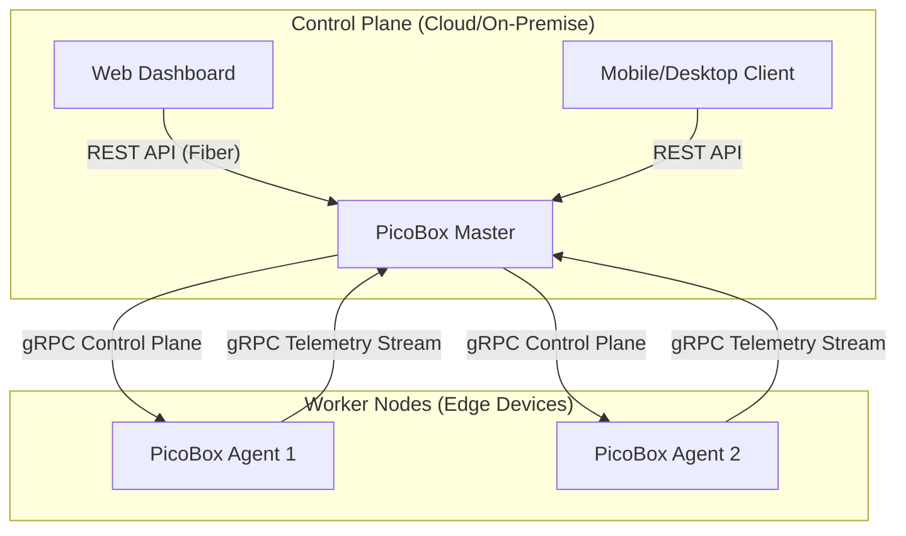

# 🚀 PicoBox: Ultra-Lightweight Distributed Container Platform

PicoBox is a high-performance, ultra-lightweight container orchestration platform designed for Edge Computing and IoT environments. It bypasses heavy container runtimes like Docker or containerd, instead controlling the **Linux Kernel** directly via Namespaces and Cgroups v2.

---

## 🧠 Core Philosophy: "Kernel-First, Zero-Dependency"

PicoBox is built on the belief that for edge devices, every megabyte of RAM and every CPU cycle counts. By utilizing pure Go and direct system calls, PicoBox provides a robust isolation environment with a near-zero footprint.

- **Minimalist Runtime**: No background daemons (like `dockerd`) are required except for the `picoboxd` agent.
- **Direct Orchestration**: The Master server communicates directly with agents via high-performance gRPC streams.
- **Transparent Isolation**: Understand exactly how your containers are isolated using standard Linux tools like `unshare`, `nsenter`, and `lsns`.

---

## ✨ Key Technical Features

### 1. Advanced Process Isolation (Linux Namespaces)
PicoBox utilizes the `clone()` and `unshare()` system calls to wrap processes in dedicated namespaces:
- **PID Namespace**: Isolates the process ID space; the containerized process sees itself as PID 1.
- **Network Namespace**: Provides a private network stack, including its own loopback device and routing tables.
- **Mount Namespace**: Decouples the file system hierarchy, enabling `pivot_root` for complete root file system isolation.
- **UTS & User Namespaces**: Isolates hostnames and grants root-like privileges within the container without compromising the host's security.

### 2. Resource Management (Cgroups v2)
Strict resource boundaries are enforced using the unified Cgroups v2 hierarchy:
- **Memory Limits**: Prevents OOM (Out of Memory) conditions on the host by killing rogue containers.
- **CPU Throttling**: Ensures fair CPU distribution across multiple workloads using `cpu.max`.
- **IO Control**: Monitors and restricts disk IO wait to maintain system responsiveness.

### 3. Distributed Architecture (gRPC & Protocol Buffers)
A contract-first communication layer ensures typed safety and high throughput:
- **Bi-directional Heartbeats**: Agents stream telemetry (CPU, Mem, Disk) to the Master in real-time.
- **Atomic Operations**: Deploying or killing containers are handled via unary gRPC calls with consistent error mapping.

---

## 🏗 System Architecture



---

## 🛠 Tech Stack Deep Dive

| Component | Technology | Rationale |
| --- | --- | --- |
| **Daemon (Agent)** | Go 1.24.2, `x/sys/unix` | Static binaries, direct syscall access, high concurrency. |
| **Master Server** | Go, gRPC, Fiber | Low latency communication, easy-to-use REST interface. |
| **Web UI** | Next.js, Tailwind, TanStack | Modern, responsive, and type-safe frontend. |
| **Protocol** | Protobuf v3 | Compact binary format, cross-language compatibility. |
| **Storage** | OverlayFS, loopback | Efficient layered file systems for container images. |

---

## 📂 Project Structure

```text
picobox/
├── .github/      # CI/CD Workflows (Auto-build & Test)
├── api/proto/    # Protobuf definitions for gRPC contracts
├── bin/          # Output directory for compiled binaries
├── cmd/          
│   ├── picoboxd/        # Node agent entrypoint
│   └── picobox-master/  # Central control tower entrypoint
├── pkg/
│   ├── isolation/ # Kernel level isolation (Namespaces, Cgroups)
│   ├── network/   # gRPC wrappers and communication logic
│   └── storage/   # RootFS and Volume management
├── script/       # Core automation (setup, build, test, deploy)
└── web/          # Next.js 15+ Dashboard UI
```

---

## 🚀 Quick Start Guide

### Prerequisites
- **Kernel**: Linux 5.10+ (Namespaces & Cgroups v2 enabled)
- **Permissions**: **Root access** is mandatory for isolation features.
- **Environment**: Go 1.24.2+, Node.js 20+, `protoc` compiler.

### 1. Initialize Environment
Install all system dependencies and Go tools (protoc-gen-go, etc.) in one command:
```bash
sudo ./script/setup.sh
```

### 2. Build the Ecosystem
Compiles the Protobuf files, builds the Go binaries for Master/Agent, and prepares the Web Dashboard:
```bash
./script/build.sh
```

### 3. Comprehensive Validation
Run the full-stack validation loop including unit tests and real process integration:
```bash
./script/build_n_test.sh --fullstack
```

---

## 🛡 Development Policy

1. **Safety First**: All syscall errors must be wrapped with context to facilitate debugging in isolated environments.
2. **Contract First**: Any changes to communication must start with `api/proto/picobox.proto`.
3. **Zero Placeholder**: No code without tests. All logic must pass the `./script/build_n_test.sh` loop.
4. **Docs**: All project documentation stays in **Korean**, while code comments and commit messages are in **English**.

---

## 📄 License & Status
This project is currently under active development.  
