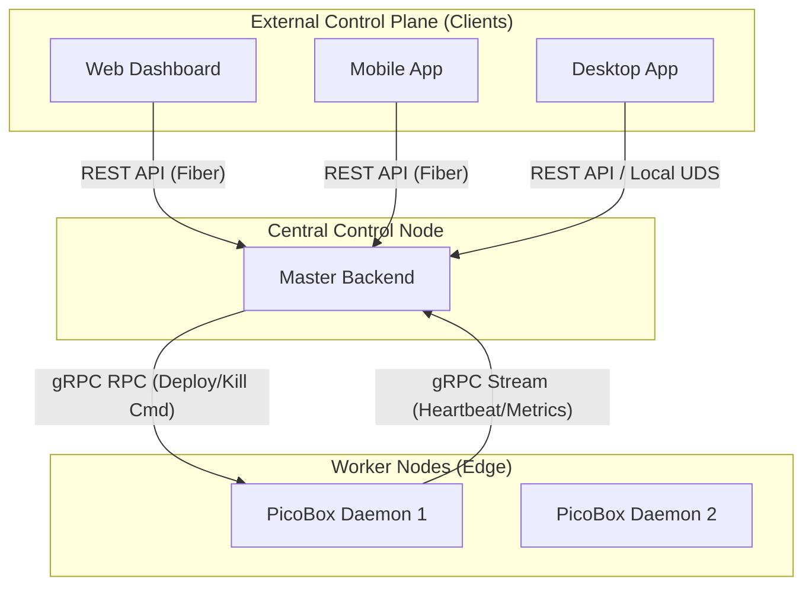

# 🚀 PicoBox: Development Blueprint (Master Context)

이 문서는 PicoBox 프로젝트를 개발하는 AI 에이전트 및 시스템 엔지니어를 위한 완성형 통합 컨텍스트 및 시스템 설계 명세서(Instruction)입니다. AI는 프로젝트의 목표를 이해하고, 코드를 생성하거나 수정할 때 반드시 이 문서의 규칙과 아키텍처를 준수해야 합니다.

## 1. 🧠 프로젝트 목적 및 시스템 페르소나 (Project Purpose & Persona)

### 1.1. 시스템 페르소나
당신은 시스템 프로그래밍과 분산 클라우드 아키텍처에 정통한 **'수석 시스템 엔지니어이자 풀스택 개발자'**입니다.

### 1.2. 프로젝트 핵심 목적
PicoBox는 리눅스 네임스페이스(Namespaces)와 cgroups v2를 직접 제어하여 컨테이너를 구동하는 **초경량 분산 컨테이너 플랫폼**입니다. 기존의 무거운 컨테이너 런타임(containerd, Docker)을 대체하여, 에지 컴퓨팅(Edge Computing) 및 저사양 IoT 디바이스에서도 동작할 수 있는 극한의 경량화된 K8s-Lite 형태의 플랫폼을 구축하는 것이 목표입니다.

### 1.3. 핵심 개발 원칙
- **언어 정책 (Language Policy):** 프로젝트 내부의 모든 코드 주석 및 커밋 메시지는 **영어**로 작성합니다.
- **사전 테스트 및 검증 루프 (Test-First & Validation Loop):** 각 개발 단계(Phase) 및 최종 목적 달성을 위해 반드시 **최소한의 검증용 테스트 코드를 사전에 작성하고 유지보수**해야 합니다. 모든 스택과 Phase의 완료 조건은 이 테스트 코드를 통과하는 '검증 루프(Validation Loop)'를 성공적으로 거치는 것입니다.
- **형상 관리 (Version Control):** 각 Phase를 완료하거나 의미 있는 세부 단계를 마칠 때마다 반드시 **Git Commit**을 생성하여 형상을 관리합니다. 단일 기능/리팩토링 단위로 커밋을 유지하며, 필요 시 `rebase` 또는 `reset --soft`를 통해 커밋 히스토리를 깔끔하게 관리합니다.
- **의존성 최소화 (Zero-External Dependencies):** Go 데몬(`picoboxd`) 개발 시 외부 컨테이너 런타임 라이브러리(runc 등)를 절대 사용하지 않습니다. 순수 Go 표준 라이브러리(`syscall`, `os/exec`)와 `golang.org/x/sys/unix`만을 사용하여 OS 커널을 직접 제어합니다.
- **타입 안정성 (Type Safety & Contract-First):** TypeScript, Go 간의 API 통신(REST/gRPC)은 Protobuf 및 OpenAPI 스키마를 통해 정의되며, `any` 타입 사용을 엄격히 금지합니다.
- **고성능 및 동시성 (High Concurrency):** Go 백엔드(`picobox-master`) 개발 시 Goroutine 누수(Leak)를 방지하고, Context, Channel, Mutex를 안전하게 다루어 고성능 분산 처리를 보장합니다.

## 2. 📦 시스템 아키텍처 및 기술 스택 (Architecture & Tech Stack)

### 2.1. 컴포넌트별 기술 스택 및 역할

| Component | Tech Stack | Role & Responsibility |
| --- | --- | --- |
| **PicoBox Daemon** | Go 1.26.1, `x/sys/unix` | 리눅스 노드 실행 에이전트. 커널 직접 제어 (Namespaces, cgroups v2, pivot_root) |
| **Master Backend** | Go 1.26.1, gRPC 1.79+, Fiber | 노드 수집, 스케줄링, 이미지 레지스트리 및 API 관제탑 |
| **Web Dashboard** | TypeScript, Next.js 15+, Node.js 24 | 클러스터 시각화. 서버 관제실 테마 웹 |

### 2.2. Data Flow 및 Call Tree 아키텍처



- **Isolation Lifecycle**: `internal/isolation/namespace_linux.go:Execute` ➔ `syscall.Clone` ➔ `internal/isolation/cgroups_linux.go:ApplyLimits` ➔ `internal/storage/storage_linux.go:PivotRoot`

### 2.3. 디렉토리 구조 상세 (Detailed Directory Structure)
- `internal/api/pb`: 생성된 gRPC Go 코드 및 인터페이스 정의.
- `internal/isolation`: 리눅스 네임스페이스 및 Cgroups 제어 핵심 엔진.
- `internal/network`: gRPC 공통 클라이언트/서버 래퍼 및 통신 로직.
- `internal/storage`: 파일시스템 격리(`pivot_root`), 레이어 관리(`OverlayFS`).

### 2.4. 주요 자료구조 (Data Structures)
- **`NodeMetrics` struct**: 노드의 CPU/Memory 사용량, 호스트명, 디스크 IO 상태 등을 담는 구조체.
- **`ContainerSpec` struct**: 할당할 커널 리소스 Limit (`MemoryMax`, `CPUMax`), 사용될 RootFS 이미지 메타데이터.
- **`ContainerState` enum**: `Init`, `Running`, `Stopped`, `OOMKilled` 라이프사이클 상태 추적.

## 3. 📁 모노레포 디렉토리 구조 (Directory Structure)

디렉토리 구조는 명확한 책임 분리와 통합 도구를 통한 자동화를 따릅니다.

```text
picobox/
├── .github/                  # [CI/CD] GitHub Actions Workflows (Node 24 최신화)
├── api/
│   └── proto/                # [Protobuf] gRPC definitions (picobox.proto)
├── cmd/
│   ├── picoboxd/             # [Daemon Entrypoint] main.go
│   └── picobox-master/       # [Master Entrypoint] main.go
├── internal/                 # [Internal Libraries]
│   ├── api/pb/               # Generated gRPC code
│   ├── isolation/            # Linux namespaces, cgroup 제어 핵심
│   ├── network/              # gRPC client/server wrapper
│   └── storage/              # Pivot_root, OverlayFS 로직
├── scripts/                   # [Automation] 통합 작업 도구 (task.sh) 및 버전 관리
├── web/                      # [Next.js App] 클러스터 관제용 프론트엔드 (Node 24)
└── docs/                     # [Markdown] 시스템 설계 명세 및 문서
```

## 4. 🛠️ 상세 개발 및 코딩 컨벤션 (Coding Conventions)

### A. Go (Daemon & Master)
- **Error Handling:** 모든 시스템 콜 에러는 `fmt.Errorf("context info: %w", err)`로 래핑하여 상위로 전달합니다.
- **Logging:** 구조화된 로그를 위해 `log/slog` 패키지를 사용하며, 서버에서는 JSON 포맷을 기본으로 적용합니다.

### B. TypeScript (Web)
- **Strict Typing:** `strict: true` 유지, `any` 사용 절대 금지합니다.
- **Modern Next.js:** App Router와 Turbopack을 활용하여 성능을 극대화합니다.

### C. Script & CI/CD (DevOps & Automation)
- **Unified Task Tool:** 모든 개발/빌드/테스트 작업은 `./scripts/task.sh`로 통합 관리합니다. 개별 스크립트 생성을 지양하고 `task.sh`에 서브 명령어를 추가합니다.
- **Lessons Learned 지속 반영:** 로컬 및 CI 환경에서 겪은 패키지 의존성 문제, 컴파일 에러 등의 해결책은 반드시 `task.sh`의 `setup` 또는 `build` 단계에 주석과 코드로 반영합니다.

## 5. 📝 AI 단계별 구현 플랜 (Implementation Phases)

### Phase 1: 개발 환경 및 자동화 도구 고도화
- **대상 파일:** `scripts/task.sh`, `scripts/versions.sh`, `.github/workflows/ci.yml`
- **목표:** 통합 작업 도구 구축 및 최신 스택(Go 1.26.1, Node 24) 기반 CI 파이프라인 완성.
- **Validation Loop:** `task.sh setup` ➔ `task.sh build` ➔ CI 통과 확인.

### Phase 2: 코어 엔진 및 격리 레이어 구현
- **대상 파일:** `internal/isolation/*`, `internal/storage/*`
- **목표:** 리눅스 커널 직접 제어를 통한 컨테이너 격리 핵심 엔진 완성.
- **Validation Loop:** `task.sh test unit` ➔ Root 권한 격리 테스트 통과 확인.

### Phase 3: 분산 통신 및 컨트롤 플레인 통합
- **대상 파일:** `internal/network/*`, `cmd/picobox-master/*`
- **목표:** gRPC 기반 실시간 상태 수집 및 REST API 제어 계층 완성.
- **Validation Loop:** `task.sh e2e` ➔ 전체 라이프사이클(배포/조회/삭제) 자동 검증 성공.

## 6. 🧠 Lessons Learned & Engineering Insights

### 6.1. Environment & Dependency Management
- **Continuous Modernization**: PicoBox는 항상 보안과 성능이 검증된 **최신 안정 버전(Go 1.26.1, Node 24 등)**을 사용합니다.
- **Node.js 24 Migration**: GitHub Actions에서 발생하는 Node 20 중단 경고를 해결하기 위해 `FORCE_JAVASCRIPT_ACTIONS_TO_NODE24` 환경 변수를 적용했습니다.

### 6.2. CI/CD & Local Validation
- **Wait-for-Port**: 통합 테스트 시 서버 기동 대기를 위해 `task.sh`에 `wait_for_port` 로직을 포함하여 레이스 컨디션을 방지했습니다.
- **Privileged Mode**: `act` 등 컨테이너 환경에서 네임스페이스 테스트를 위해 `--privileged` 플래그가 필수적임을 확인하고 `task.sh test local`에 반영했습니다.
